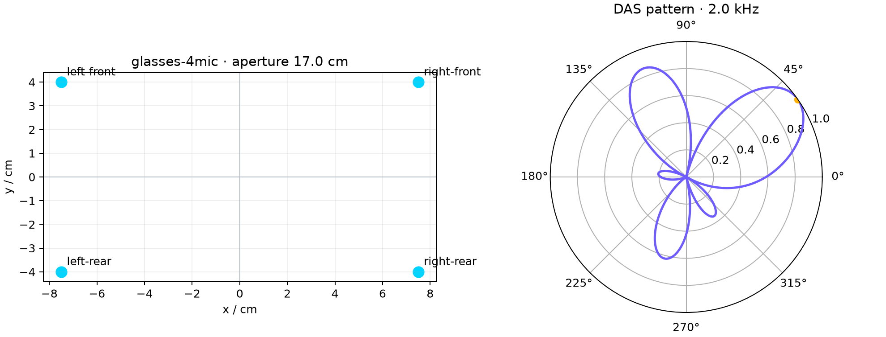
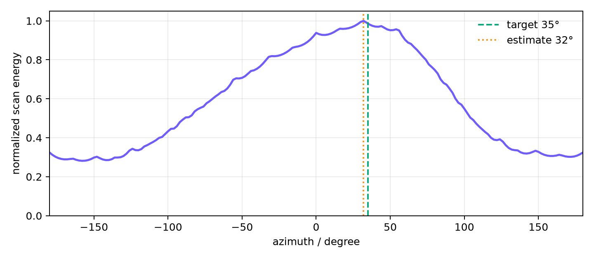

# HearWeave

[](https://github.com/WonderfulClaire/HearWeave/actions/workflows/ci.yml)
[](pyproject.toml)
[](LICENSE)

> Open spatial-audio building blocks for smart glasses and hearables. 面向智能穿戴设备的开箱即用多麦阵列工具包。

HearWeave is a lightweight Python toolkit for prototyping microphone-array processing on **AI glasses, earbuds, and other smart wearable devices**. It packages readable reference implementations, wearable geometry presets, deterministic synthetic data, and visualization helpers in one repository.



## Why HearWeave

General speech-enhancement repositories usually assume linear or circular tabletop arrays. Wearable devices have different constraints: temple microphones, left/right cooperation, small asymmetric sub-arrays, head shadowing, and strict compute budgets. HearWeave starts from those device geometries while keeping every baseline easy to inspect.

## Included in v0.1

- Smart-glasses 4-microphone and asymmetric 6-microphone earbud presets
- Far-field multi-channel scene simulation
- Delay-and-sum and frequency-domain MVDR beamforming
- GCC-PHAT pairwise delay estimation
- Grid-based azimuth localization
- Binaural coherence enhancement baseline
- SNR and SI-SDR metrics
- Geometry, beampattern, and localization visualizations
- Synthetic smart-glasses sample scene with no recorded speech

## Quick start

```bash
git clone https://github.com/WonderfulClaire/HearWeave.git
cd HearWeave
python -m pip install -e .
hearweave-demo --output demo-output
```

```python
import numpy as np
from hearweave import delay_and_sum, glasses_4mic, scan_azimuth_energy

scene = np.load("datasets/simulated_glasses_scene.npz")
geometry = glasses_4mic()
signals = scene["microphone_signals"]
sample_rate = int(scene["sample_rate_hz"])

azimuth, scores, grid = scan_azimuth_energy(signals, geometry, sample_rate)
enhanced = delay_and_sum(signals, geometry, sample_rate, azimuth)
print(f"estimated direction: {azimuth:.1f}°")
```

## Demo result

The checked-in scene is a deterministic smoke test: a synthetic speech-like probe reaches the glasses array from 35° with independent channel noise. It is not a benchmark or real-device accuracy claim.



Regenerate the dataset and figures with:

```bash
python -m pip install -e .
python scripts/generate_assets.py
```

## Design principles

1. **Wearable geometry first** — coordinates and device assumptions are explicit.
2. **Readable baselines** — reference code is suitable for learning and experiment scaffolding.
3. **Reproducible artifacts** — demos have fixed seeds and synthetic redistributable data.
4. **Honest boundaries** — simulations are never presented as real-device evidence.
5. **Composable APIs** — geometry, simulation, localization, enhancement, metrics, and plots stay separable.

Read [Algorithms and assumptions](docs/ALGORITHMS.md) before using results in a paper or product comparison.

## Scope and limitations

HearWeave is research and prototyping software—not a hearing aid, safety device, or clinically validated enhancement system. The first simulator does not model rooms, head-related transfer functions, microphone mismatch, or clock drift. Those are intentional extension points, not hidden assumptions.

## Roadmap

- [ ] Measured and simulated wearable RIR loaders
- [ ] SRP-PHAT and multi-source tracking
- [ ] Head-shadow and microphone-mismatch simulation
- [ ] Streaming/block-processing interfaces
- [ ] ONNX-friendly low-compute baselines
- [ ] Real-device evaluation protocol and dataset adapters
- [ ] BeamBench integration examples

## Contributing

New device layouts, algorithms, tests, and reproducible evaluation fixtures are welcome. See [CONTRIBUTING.md](CONTRIBUTING.md). Security or privacy issues should use the [private reporting flow](SECURITY.md).

If HearWeave supports published work, the repository includes a machine-readable
[citation file](CITATION.cff).

## License

[MIT](LICENSE)
