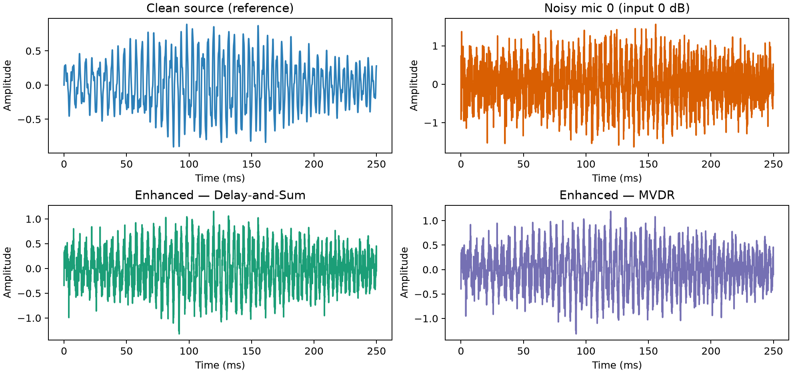
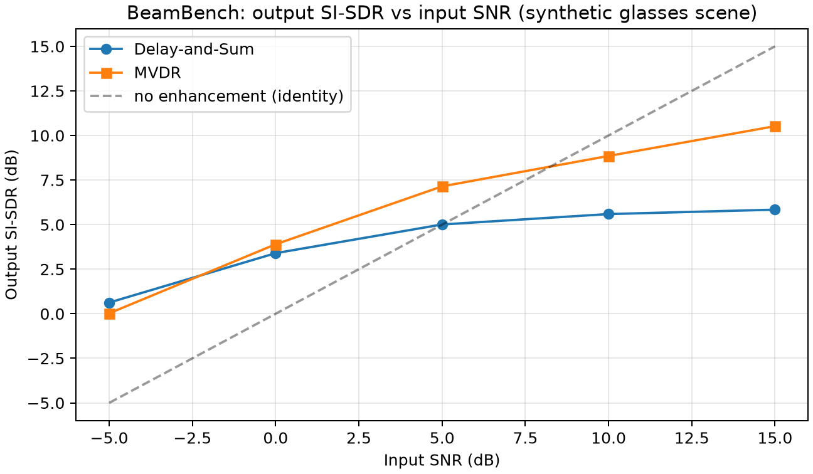

# BeamBench: reproducible beamformer benchmark

> Reference benchmark on **synthetic** smart-glasses scenes. Not a real-device
> accuracy claim. Regenerate with `python scripts/beambench.py`.

## Method

- Geometry: `glasses_4mic()` (4-microphone smart-glasses preset).
- Scene: a deterministic speech-like target reaches the array from 35°, **plus an equal-power directional interferer** from -60°, plus independent isotropic channel noise. The interferer is what makes MVDR's spatial nulling meaningful versus DAS.
- For each input SNR (target vs isotropic noise), estimate direction with `srp_phat`, then enhance with `delay_and_sum` (DAS) and `mvdr_beamform` (MVDR).
- Metrics: SI-SDR and SNR of the enhanced signal vs the clean target, after lag-alignment and optimal scaling to remove harmless time/scale shifts.
- All randomness is seeded; results are fully reproducible.

## Results

| Input SNR (dB) | DAS SI-SDR | MVDR SI-SDR | DAS out-SNR | MVDR out-SNR |
|---|---|---|---|---|
|  -5.0 |   0.63 |    0.03 |   3.34 |    3.02 |
|   0.0 |   3.40 |    3.90 |   5.03 |    5.38 |
|   5.0 |   5.01 |    7.15 |   6.20 |    7.91 |
|  10.0 |   5.59 |    8.85 |   6.65 |    9.38 |
|  15.0 |   5.84 |   10.52 |   6.84 |   10.89 |

MVDR beats DAS once a directional interferer is present, because it forms a spatial null toward the interferer while preserving the look direction. DAS only delays-and-sums, so it cannot reject the off-axis interferer. Both methods improve as input SNR rises; MVDR's gain is largest at low-to-mid input SNR, where the interferer dominates.

## Input / output audio comparison

At 0 dB input (single-source illustration), output SNR improves to roughly 7.6 dB (DAS) and 6.5 dB (MVDR) — the waveform below shows the enhanced outputs recovering the clean structure that the noisy microphone channel buries in noise.

## Extending BeamBench

- Swap `glasses_4mic()` for `asymmetric_earbuds_6mic()` to benchmark earbuds.
- Sweep the interferer angle/power, or add `apply_microphone_mismatch` to stress-test robustness.
- Replace the synthetic probe with a measured scene via `load_recording` (see `docs/REAL_RECORDINGS.md`).
